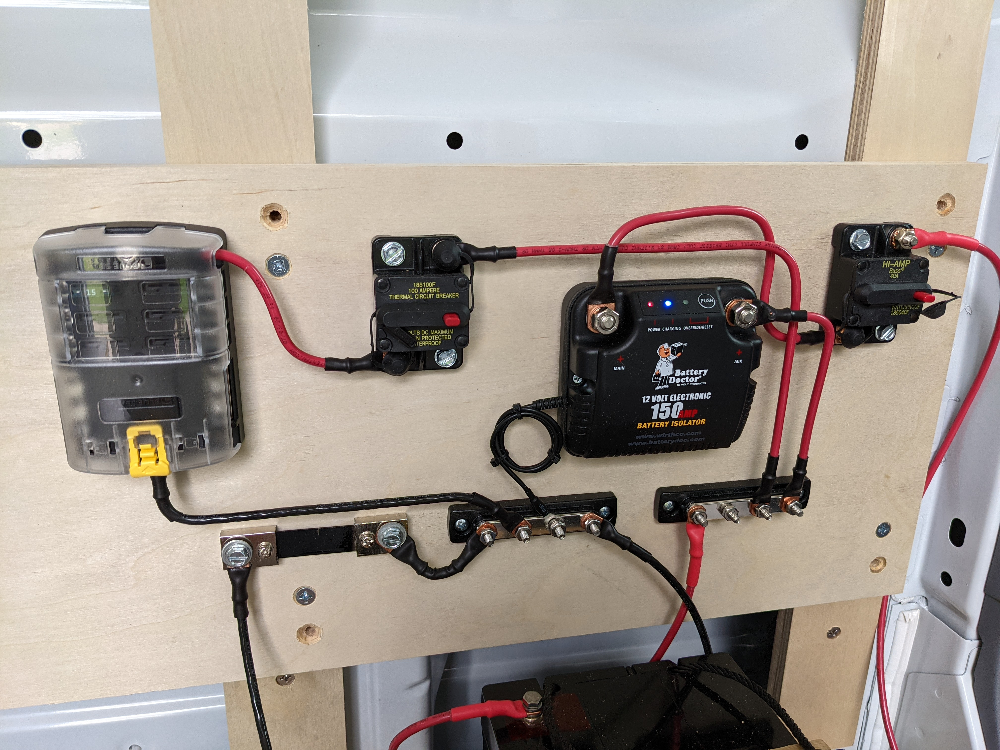
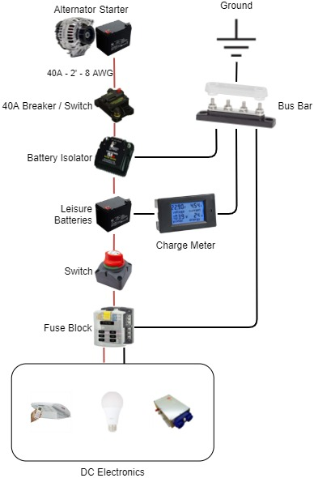
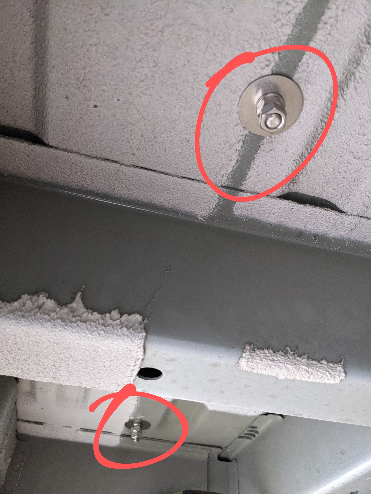
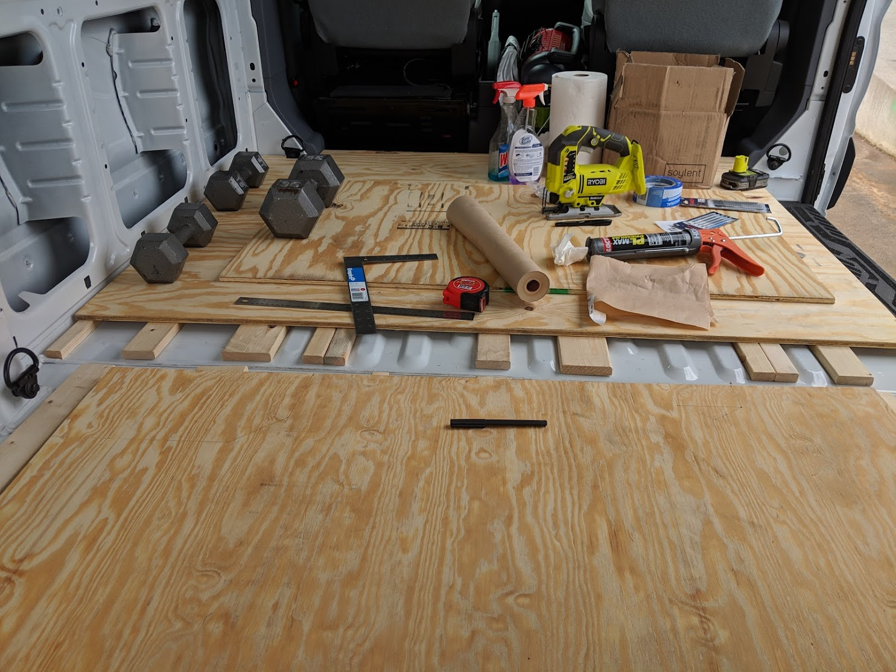
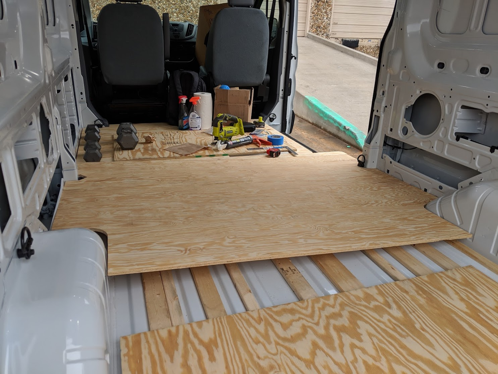
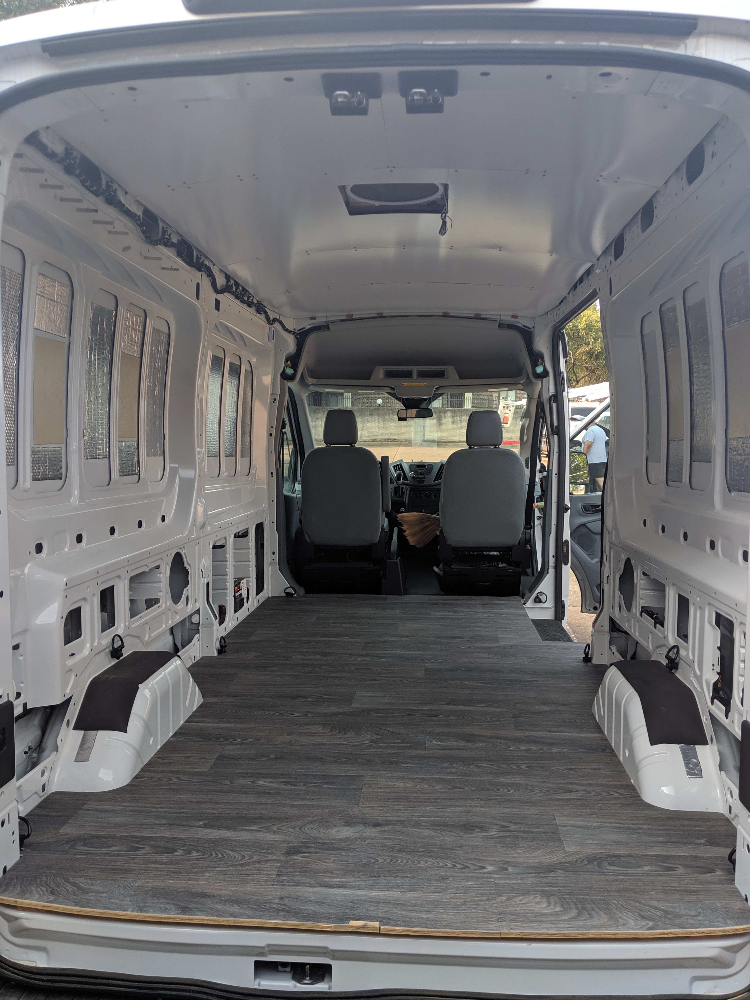
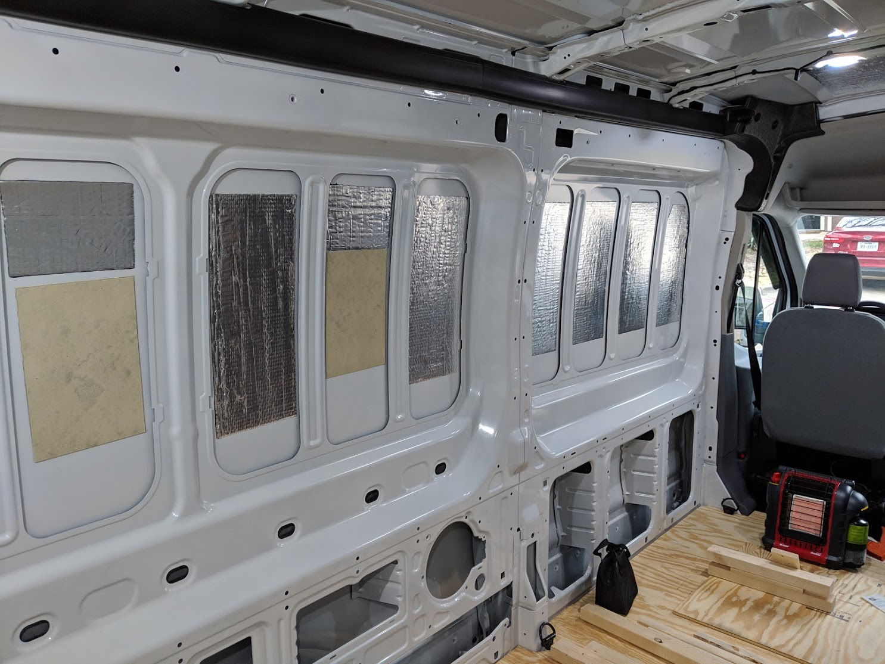
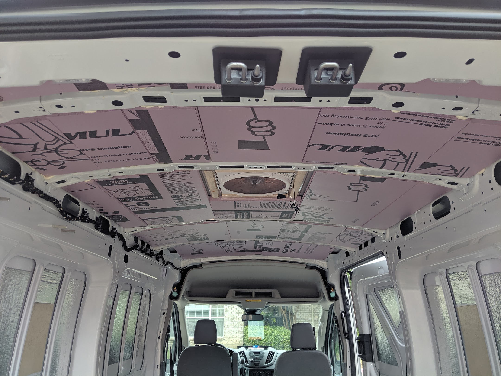
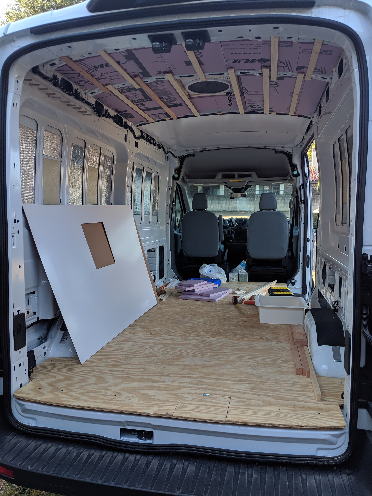

# About my van conversion

## Van Specs
2018 Ford Transit 250 Cargo Van  
Medium Roof  
148" Wheelbase  
3.7L TIVCT V6 Engine  
6-Speed Auto Select Shifter TR  
Current mileage: 6,525 miles  

## Notable Features
- x1 [100 AMP auxiliary battery](https://amzn.to/2SBM3h0) (expandable to support 2 batteries)
- [Battery Isolator](https://amzn.to/3w7A7S1)
- [Ceiling Fan](https://amzn.to/3qB7eMV) with remote control
- [Sound Insulation](https://amzn.to/3jw4jDO)

## Electrical
The battery base can fit 2 auxiliary batteries, currently a single [100 AMP auxiliary battery](https://amzn.to/2SBM3h0) is seated and tied down with [Ratchet Tie Down Straps](https://amzn.to/3653kCw) hooked onto anchors. The [Tie Down Anchors](https://amzn.to/3qB4mzF) are bolted through the van floor for safety (I wish more builders would do this, a 50 lb projectile would be very lethal). The bolt is secured by a washer, spring washer, jam nut and loctite threadlocker. 

The auxiliary battery is charged by the alternator through the Ford CCP (Customer Connection Point). Between the CCP is a [40 AMP Circuit Breaker](https://amzn.to/3yoxIUH) and a [Battery Isolator](https://amzn.to/3w7A7S1). Another switch is placed between the auxiliary battery and the [Fuse Block](https://amzn.to/2TftkbF). Two [Bus Bars](https://amzn.to/3AeXf4i) support the negative and positive connections. An [LCD Voltmeter Display](https://amzn.to/3hnIqnl) allows us to monitor the health of the auxiliary battery.

Initially I planned to set the auxiliary battery to be in the rear of the van, after measuring the distance from the Ford CCP, a lower gauge wire was required to span the distance. However the wire from the alternator to the Ford CCP should also be considered, if the wire from the alternator to the CCP cannot support the current due to the increased resistance from the added distance from the alternator to the auxiliary batteries, there could be a major problem. So I opted to keep the distance short and placed the battery near the CCP.

## Flooring
[Wooden slats](https://www.homedepot.com/p/1-in-x-4-in-x-3-25-ft-Spruce-Pine-Fir-Common-Board-Bed-Slat-Actual-Dimensions-0-75-in-x-3-5-in-x-39-in-KDCBCC1439HFT/206883043) were adhered using [Loctite Construction Adhesive](https://amzn.to/3wcM9JM) to the floor of the van  
3/4" Plywood was cut to fit and screwed into the slats
[Vinyl Sheet Flooring](https://www.homedepot.com/p/TrafficMASTER-Scorched-Walnut-Grey-Wood-Residential-Vinyl-Sheet-Flooring-12ft-Wide-x-Cut-to-Length-C9450407C895P14/300866848) was cut to fit and adhered to the plywood using [Roberts 7350 Flooring Adhesive](https://amzn.to/365Vg4h)

## Walls
[Butyl Automotive Sound Deadener](https://amzn.to/3jw4jDO) was heated to spec and pressed into exposed areas of the van walls  
Once the framing is complete, walls will go up  
_Work in progress_  

## Ceiling
The [Maxxfan Deluxe](https://amzn.to/3qB7eMV) was initially planned to be installed closer to the rear of the van, but that required cutting into the structural ribs in the ceiling of the van, so the fan was moved forward. Currently it sits just above the end of where the bed would be positioned. The [Maxxfan Deluxe](https://amzn.to/3qB7eMV) sits on a wooden [Vent Adapter](https://www.ebay.com/itm/132298128172), this not only provides a foundation for the fan but also protects the fan from the shifting stresses of the sheet metal, the drawback is the fan sits about an inch taller, longevity is worth the offset.  

[XPS foam insulation](https://www.homedepot.com/p/Owens-Corning-FOAMULAR-150-1-in-x-4-ft-x-8-ft-R-5-Scored-Square-Edge-Rigid-Foam-Board-Insulation-Sheathing-20WE/207179253) was cut, fitted and adhered using [foam board adhesive](https://www.homedepot.com/p/Loctite-PL-300-10-fl-oz-Foamboard-Adhesive-1421941/202020476) and [foam sealant](https://www.homedepot.com/p/GREAT-STUFF-16-oz-Gaps-and-Cracks-Insulating-Foam-Sealant-with-Quick-Stop-Straw-99053937/206977048), more details about my thoughts on [insulation below](#insulation).  

In order to maximize vertical space, 0.5" slats were cut from lumber using a table saw and adhered with [construction adhesive](https://amzn.to/3wcM9JM) to the ceiling ribs. White hardboard similar to [this](https://www.homedepot.com/p/EUCATILE-32-sq-ft-96-in-x-48-in-Hardboard-Thrifty-White-Tile-Board-346428/308731683) was cut to fit and screwed into the slats. The adhesion is very strong and was capable of supporting weight > 50 lbs next to the ribs. However my greatest regret is not waiting to find a transit with the high roof instead of medium roof, high roof was very scarce at the time of purchase. 

[Link to video](https://youtu.be/DCxn2t7xEZo) testing the fan during rain  

## Framing
_Work in progress_  
[3/4" Birch Plywood](https://www.homedepot.com/p/Columbia-Forest-Products-3-4-in-x-4-ft-x-8-ft-PureBond-Birch-Plywood-165921/100077837) cut in slats secured with  
[Stainless 1/4-20 Machine Screws](https://amzn.to/3h3vjZA) screwed into  
[Steel Rivet Nuts](https://amzn.to/3hlWk9A) installed with  
[Astro 1442 Rivet Nut Setter](https://amzn.to/3w7jJ3X) that were set into pre-existing holes by Ford  

I used Birch Plywood due to its high density and tensile strength, it's also a relatively nice wood commonly used in furniture. I ended up buying a [40-tooth](https://amzn.to/3hnm6u3) blade for a cleaner cut and was happy with the results.

## Insulation
[XPS foam insulation](https://www.homedepot.com/p/Owens-Corning-FOAMULAR-150-1-in-x-4-ft-x-8-ft-R-5-Scored-Square-Edge-Rigid-Foam-Board-Insulation-Sheathing-20WE/207179253) was initially installed on the ceiling using [foam board adhesive](https://www.homedepot.com/p/Loctite-PL-300-10-fl-oz-Foamboard-Adhesive-1421941/202020476) and [foam sealant](https://www.homedepot.com/p/GREAT-STUFF-16-oz-Gaps-and-Cracks-Insulating-Foam-Sealant-with-Quick-Stop-Straw-99053937/206977048) on adjacent sides of the foam board. Reason being to avoid an airtight foam board installation; allowing the gaps between the board and sheet metal to breath. This is counter-intuitive to insulation but I was afraid of moisture being trapped within these gaps resulting in the inevitable growth of mold. I ended up removing a couple panels next to the ceiling fan while diagnosing a squeak and left the remaining panels in. The squeak was from vibrations in the fan, which I ended up dampening by reinforcing underneath the fan with wooden slats.

## Previous build
My first van conversion was on a 2017 Chevy City Express (left vehicle in image), it was a simple build with XPS insulation on the ceiling and extendable bed frame supporting a twin mattress with storage underneath. I took it up to Breckenridge, CO and realized I wanted something with more space where I could stretch my legs and walk around inside.

